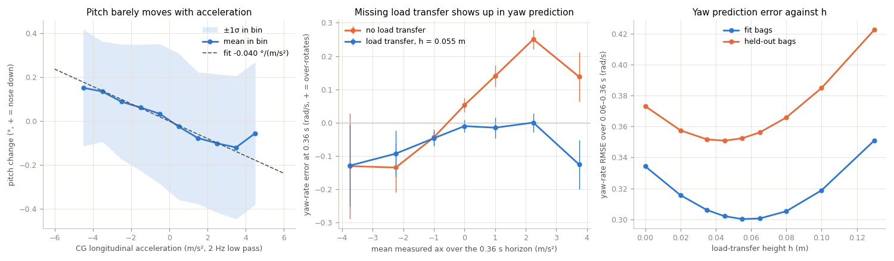

# Load transfer from logged driving

Offline analysis of two questions about longitudinal load transfer in the Fiala body models:

1. Can the chassis pitch reported by the MCU EKF serve as a load-transfer measurement, for
   example to seed the load transfer at the first MPPI sample?
2. How much load transfer does logged driving support, and does it improve the model's
   predictions?

## Running it

```bash
source ~/fireball_ws/install/setup.bash          # xxcar_msgs, for extraction only
./extract_bags.py ~/bags/iros* --out /tmp/load_transfer/data
./pitch_response.py --data /tmp/load_transfer/data --plots /tmp/load_transfer/plots
./fit_load_transfer.py --data /tmp/load_transfer/data --figure /tmp/load_transfer/summary.png
```

`fit_load_transfer.py` takes about 3 minutes on the Orin, mostly in the two Nelder-Mead fits.
`--vehicle` starts from a `vehicle.yaml` instead of the carxx values used at IROS.
`--no-servo-delay` applies steering commands instantly, as the MPPI model does, instead of
through the calibrated servo dead time. `--fit-bags` chooses which bags are fitted; the others
are reported as held out.

| File | Contents |
|------|----------|
| `extract_bags.py` | `/ekf/state` and `/direct_control` from rosbag2 into one `.npz` per bag |
| `lt_data.py` | 100 Hz alignment, selection of valid driving, IMU lever-arm correction, servo model |
| `fiala_model.py` | numpy copy of `DynamicBicycleFiala4ws`, locked-AWD only, plus load transfer |
| `pitch_response.py` | pitch against acceleration: gradient, lag, gyro cross-check, plots |
| `fit_load_transfer.py` | open-loop replay, tire and load-transfer fit, h profile, summary figure |

## Data selection

Only AUTO driving is used, with both the EKF speed and the wheel speed above 2 m/s. The
analysis drops the first 0.5 s and last 1.5 s of every AUTO segment, where the operator
takes over. It also drops samples with non-finite signals or a command older than 0.1 s.

A crash is a horizontal acceleration above 12 m/s² after a 10 Hz low pass, about twice
what the tires can produce. Each one removes everything from 2 s before it to the end of its
AUTO segment.

Acceleration is moved from the IMU to the CG, because the IMU sits 6 cm behind base_link.
Without that step, r² · 0.06 m reads as forward acceleration in corners.

## Results: ~/bags/iros*, 2026-09-27

The IROS bags gave 332 s of valid data from 11 bags, and 3,073 replay starts. Fitting used
iros01–06; iros07–10 were held out.



### Pitch is real but too small and too noisy to use

- **Gradient.** At low frequency (2 Hz low pass), pitch = −0.040 °/(m/s²) × CG ax. The
  bag-bootstrap 95% interval is −0.047 to −0.033. Pitch is FLU, so the nose rises under
  throttle and dips under braking. Over the ±5 m/s² the tires allow, that is ±0.2°.
- **Speed.** Pitch follows ax within 50–100 ms. Averaged over 69 brake and 42 throttle steps,
  the pitch peaks 50–220 ms after the step.
- **It is chassis rotation, not filter leakage.** Gyro-integrated pitch gives the same
  gradient (−0.037). The EKF's own tilt corrections are uncorrelated with ax, so the moving
  tilt fusion (EK3_TILT_MOVE) does not leak acceleration into the attitude.
- **It is buried in other motion.** Pitch moves 0.30° (1σ) for other reasons, so ax
  explains only 6% of its variance. Read as an acceleration sensor, pitch carries 7.7 m/s²
  of noise against 1.9 m/s² of signal. There is also a 13 Hz chassis pitch mode, in phase
  with the IMU's ax because the IMU sits above the pitch axis.
- **Comparison with roll.** Roll follows lateral acceleration much more clearly:
  +0.24 °/(m/s²), R² 0.57.

At h = 0.05 m, one degree of pitch corresponds to about 12 N of load transfer, roughly a
whole static axle load. The pitch noise alone would therefore swing each axle's load by
about ±30%.

### Load transfer does improve the model

The replay starts the model at the measured state and runs it open loop for 6 × 0.06 s
(70 Euler substeps per step) with the logged commands. Yaw-rate RMSE in rad/s is over steps
1–6, with the value at 0.36 s in brackets:

| Model | Fit bags | Held out |
|-------|----------|----------|
| vehicle.yaml at IROS: Cf = Cr = 150, μ 0.35/0.35 | 0.598 (0.749) | 0.604 (0.781) |
| Tire balance fitted, no load transfer: Cf 39, Cr 59, μ 0.320/0.421 | 0.321 (0.307) | 0.373 (0.447) |
| Tire balance and h fitted: h 0.055 m, Cf 45, Cr 75, μ 0.325/0.398 | 0.300 (0.292) | 0.352 (0.420) |

- **The signature.** Without load transfer, the yaw error of the fitted model grows with
  the mean ax over the horizon: +0.072 (rad/s)/(m/s²). The model over-rotates under throttle,
  when the real front unloads, and under-rotates under braking. With h = 0.055 m the slope is
  +0.009.
- **The value of h.** The held-out yaw error is lowest at h = 0.045 m and flat from 0.035 to
  0.055 m. Replaying without the servo delay moves the fitted h to 0.059 m. So h ≈ 0.05 m,
  which is dFz = m·h·ax/L ≈ 0.47 N per m/s², or 3.9% of a static axle load per m/s².
- **Instantaneous is best.** Lagging the load transfer only makes things worse. Seeding a
  lagged state from pitch is the worst option: yaw RMSE 0.35–0.91 against 0.32. With
  instantaneous transfer, the initial value is overwritten within one substep.
- **No state is needed.** One fixed-point pass inside a single derivative evaluation gives
  the same result as carrying ax from the previous substep (0.3225 both). The pass evaluates
  the tires at static loads, takes their body ax, moves the load, and evaluates the tires
  again.

### Caveats

- The fits are open loop over 0.36 s. They start from the EKF sideslip and assume the CG is
  at mid-wheelbase.
- The fitted tire balance absorbs other model errors, so treat it as a starting point for
  identification, not as vehicle.yaml values.
- The coasting ratio of wheel speed to EKF speed is 0.90–0.97, depending on the tire set.
  That puts false slip into the first sample.
- Modelling the 60 ms steering servo dead time in the replay lowers the held-out yaw RMSE
  more than load transfer does: about 0.41 to 0.35.
